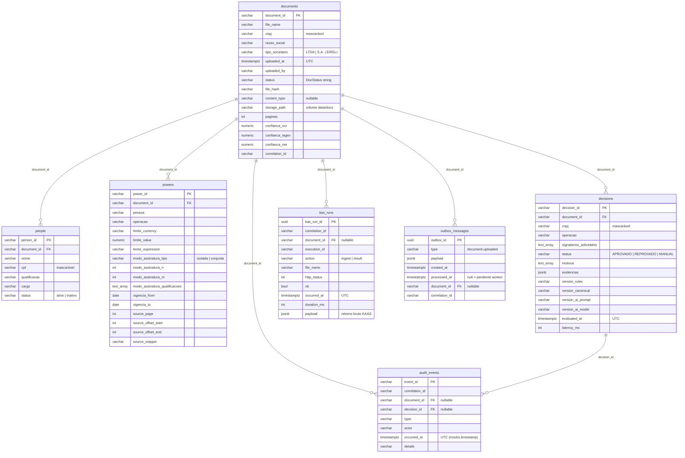

# Modelo relacional — BBF Firmas e Poderes

**Workflow:** WF-04/22  
**Banco:** PostgreSQL 16  
**ORM:** EF Core 8 + Npgsql  
**Fonte:** `src/lib/mocks.ts` (`Document`, `Person`, `Power`, `DecisionRecord`, `AuditEvent`, `KasRunResult`)

Fuso da persistência: **timestamptz UTC**. Conversão para `America/Sao_Paulo` fica na borda da API (WF-05). CNPJ e CPF são `varchar` (aceitam valor mascarado). Hash do arquivo em `documents.file_hash`. Status do pipeline = string idêntica a `DocStatus` do front.

## Tabelas e chaves

| Tabela | PK | FKs |
|---|---|---|
| `documents` | `document_id` | — |
| `people` | `person_id` | `document_id` → `documents.document_id` (ON DELETE CASCADE) |
| `powers` | `power_id` | `document_id` → `documents.document_id` (ON DELETE CASCADE) |
| `decisions` | `decision_id` | `document_id` → `documents.document_id` (ON DELETE RESTRICT) |
| `audit_events` | `event_id` | `document_id` → `documents.document_id` (ON DELETE SET NULL); `decision_id` → `decisions.decision_id` (ON DELETE SET NULL) |
| `kas_runs` | `kas_run_id` | `document_id` → `documents.document_id` (ON DELETE SET NULL) |
| `outbox_messages` | `outbox_id` | `document_id` → `documents.document_id` (ON DELETE SET NULL) |

`__EFMigrationsHistory` é tabela de controle do EF Core (não é domínio).

## Diagrama ER

## Enums string (check constraints)

| Coluna | Valores |
|---|---|
| `documents.status` | `pendente`, `processando_ocr`, `processando_iagen`, `processando_ner`, `canonico_pronto`, `validacao_oficial`, `decidido`, `revisao_humana`, `falha` |
| `people.status` | `ativo`, `inativo` |
| `powers.modo_assinatura_tipo` | `isolada`, `conjunta` |
| `decisions.status` | `APROVADO`, `REPROVADO`, `MANUAL` |
| `kas_runs.action` | `ingest`, `result` |

## Seed

Migration `AddDomainModel` insere o documento **ACME** (`doc_001` de `mocks.ts`): 3 sócios, 2 poderes, decisão `dec_001`, evento `ev_0001`, 1 `kas_runs` com payload jsonb de laboratório (sem chamada KAAS live).

Migration `AddDocumentStorageAndOutbox` (WF-06): colunas `documents.content_type` / `documents.storage_path` + tabela `outbox_messages`. Blob no filesystem (`data/docs`), não bytea.
